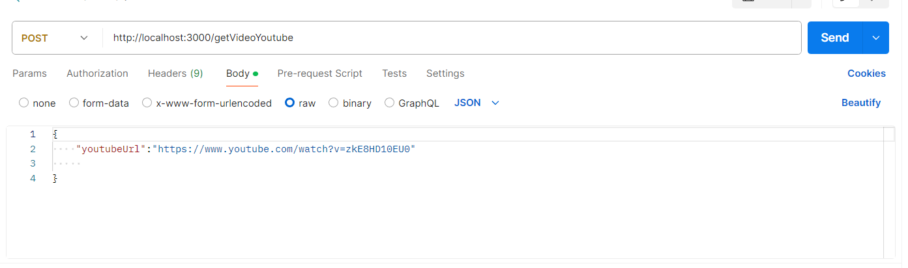

### CLONE VIDEO FROM YOUTUBE
## Hi everyone!

Với git này thì tui có demo nho nhỏ. Tui biết là ae có dow nhạc phim trên youtube về để này nọ kia , tui cũng thế . Nên là tui cũng rảnh rỗi và lên xem các pháp sư làm thế nào để code 1 con application để create ra video từ youtube :))) . Thế nào mất cả 1 buổi tối để tự mò ae à....

Ok! và ứng dụng này thì tui sẽ đứa ra 1 số điểm flow để cho mọi người cùng tham khảo kkk...

- Đầu tiên thì cứ tạo 1 cái nodejs bình thường cho nó chạy hello nyc là được...
- Thứ 2 là ae nên tìm hiểu về thư viện này [ytdl-core](https://github.com/fent/node-ytdl-core)
 trước khi xem code của tui vì đôi khi tui xem lại mà chưa chắc hiểu tui đã làm j trên nó kkk...
- Thứ 3 là tui đã thử với thư viện này nhiều cách , thay vì lấy video rồi nó lấy audio bla bla... đủ các cấu hình về chất lượng hình ảnh và âm thanh thì ời à ... tui muốn nó phải gộp lại với nhau :)) nhưng nó không có help kkk. Và vì thế tui đã đưa ra 1 solution cũng được mà cũng chưa hay lắm đó là ...
- Bước 4 là tạo ra 2 file audio và video not audio :))), rùi làm j nào làm j nào ...
- Bước 5 là gộp nó lại với fs và ffmpegProcess , thôi ace cứ tham khảo tí về tụi nó , kiểu tạo file rồi merg thì thư viện nó ghi đây ra.
- Bước 6: vì nó tạo ra 2 file dư là audio và video not audio thì tui xóa nó đi với unlink...

Tóm lại nó ok nhưng nêu xét về hiệu suất ví dụ 100 người hoặc hơn tui nghĩ nó có thể die ae à . Mà thôi có còn hơn không kkkk. Trên mạng mấy lão chỉ tạo nhưng ko merg nên tui phải đành làm ra nó kkk . Mong mọi người sẽ thích :) 
 

Và ở dưới này là api để ae chèn ảnh 

